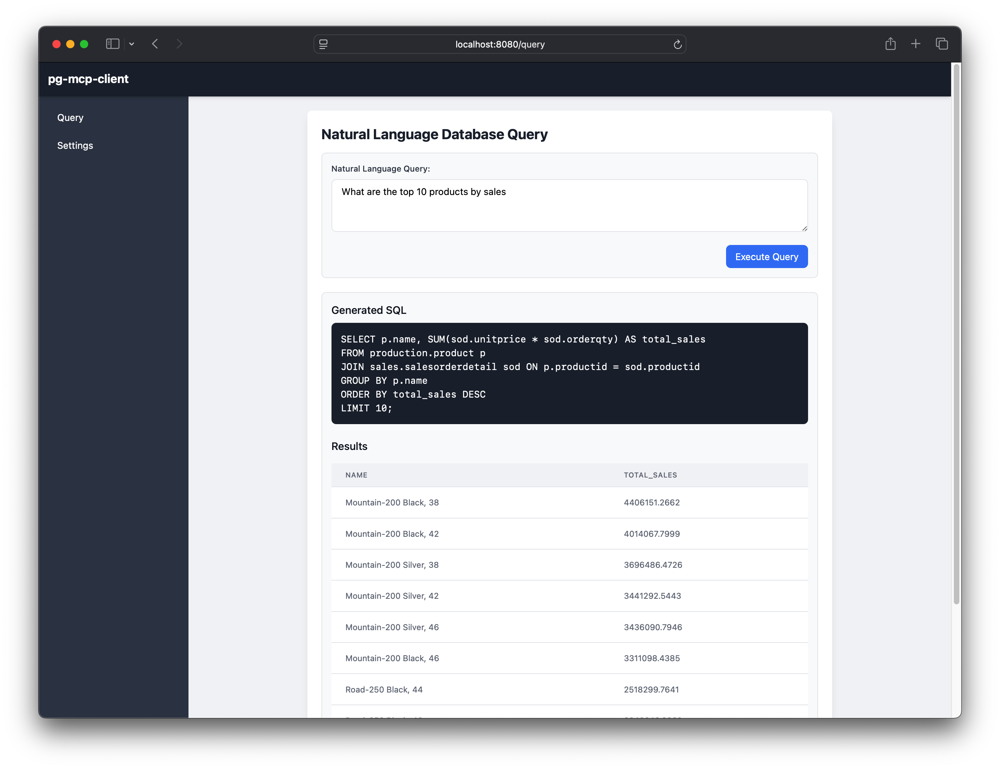

# Introduction

## Model Context Protocol for PostgreSQL

**pg-mcp** is an ecosystem for connecting LLMs (Large Language Models) with PostgreSQL databases, enabling natural language queries through a standardized protocol.

## Overview

The pg-mcp project consists of two main components:

1. **pg-mcp-server**: A server component that provides a standardized API for querying PostgreSQL databases through the Model Context Protocol (MCP).

2. **pg-mcp-client**: A web-based client application that allows users to bring their own LLM API key and query PostgreSQL databases using natural language through an intuitive UI.

_**The key benefit of this setup is that you never send your data to the LLM.**_

## Screenshots

## Features

- **Natural Language Querying**: Ask questions about your data in plain English
- **Multiple LLM Support**: Works with Anthropic (Claude), Google (Gemini), and OpenAI (_untested_) models
- **Interactive Web UI**: Clean, responsive interface built with modern web technologies
- **Standardized Protocol**: Built on the Model Context Protocol for AI systems
- **Database Schema Awareness**: Automatically analyzes database structure for accurate SQL generation

## Getting Started

If you're new to pg-mcp, check out the quickstart guides:

- [Server Quickstart](./quickstart/server.md)
- [Client Quickstart](./quickstart/client.md)
