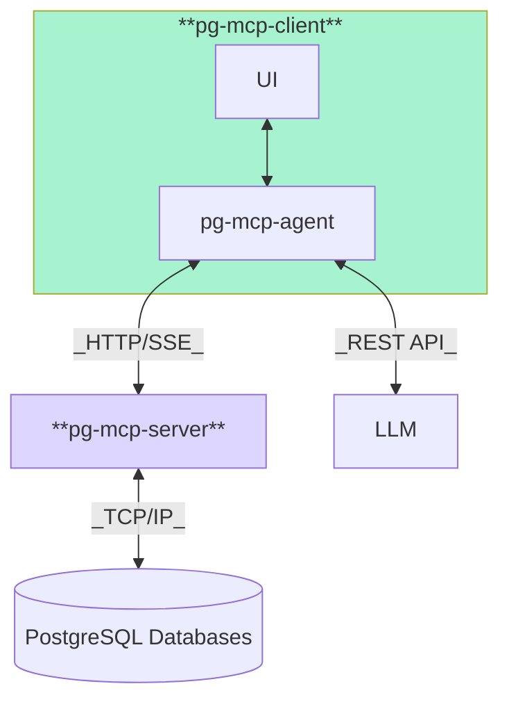

# Overview

**pg-mcp-server** is a multi-tenant [Model Context Protocol](https://modelcontextprotocol.io/) server which bridges the connection between LLM Agents and PostgreSQL databases. Built with FastMCP, the official [MCP Python SDK](https://github.com/modelcontextprotocol/python-sdk), and [AsyncPG](https://github.com/MagicStack/asyncpg), the MCP server runs in "server-mode", communicating with agents via HTTP Server Side Events (SSE) and accepting PostgreSQL connection strings while providing read-only query access to connected databases.

**pg-mcp-client** is full web application which encompasses both the UI and an agent which can communicate with the LLM of your choice via API 

## System Architecture

In this architecture:
- **pg-mcp-client** provides a user interface and agent integration
- **pg-mcp-server** connects to your PostgreSQL databases
- **LLM providers** (Anthropic, OpenAI, Google) translate natural language to SQL

## How it Works

MCP Servers provide additional tools and resources available to agents in order to enhance their capabilities. When supplied with a valid PostgreSQL database connection string, **pg-mcp-server** exposes enriched database schema information to agents, providing them with context about the structure and purpose of the database. 

Agents can take advantage of a well-documented database as **pg-mcp-server** will provide table and column comments/descriptions alongside the schema. This facilitates better understanding of user prompts from the standpoint of the database's business domain.

**pg-mcp-client** stores API Keys and connection strings in the user's browser

## Key Features

- **Multi-Database Support**: Connect to multiple PostgreSQL databases simultaneously
- **Rich Catalog Information**: Extract and expose table/column descriptions from the database catalog
- **Extension Context**: Detailed knowledge about PostgreSQL extensions like PostGIS and pgvector
- **Query Explanation**: Dedicated tool for analyzing query execution plans
- **Secure Connection Management**: Proper lifecycle for database connections with secure connection ID handling
- **Natural Language to SQL**: Built-in prompt to convert natural language to SQL queries

## Tools and Resources

### Tools
- `connect` - creates the connection from the connection string and returns a UUID `conn_id`
- `disconnect` - closes the database connection associated with the `conn_id`
- `pg_query` - executes a read-only SQL query
- `pg_explain` - provides the query execution plan for a query

### Resource Templates
Resource templates mirror the hierarchical object structure of PostgreSQL databases, and present them in a RESTful resource manner as URIs:

- `pgmcp://{conn_id}/` - Comprehensive database information
- `pgmcp://{conn_id}/schemas` - List all schemas
- `pgmcp://{conn_id}/schemas/{schema}/tables` - List tables in a schema
- `pgmcp://{conn_id}/schemas/{schema}/tables/{table}/columns` - Get columns for a table
- `pgmcp://{conn_id}/schemas/{schema}/extensions` - List extensions in a schema

### Prompts
- `nl_to_sql` - Convert natural language questions to SQL queries